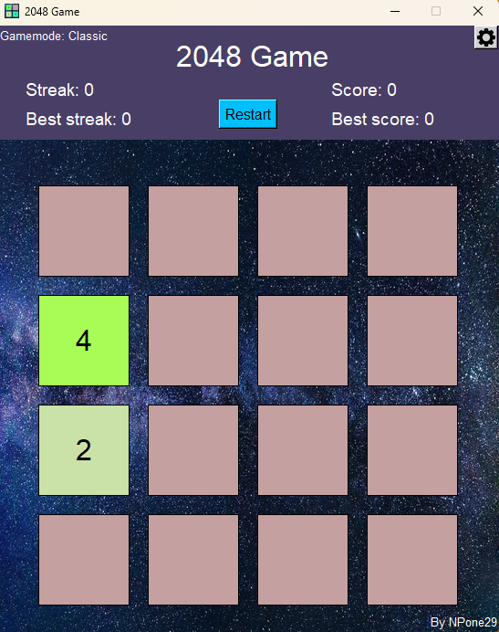
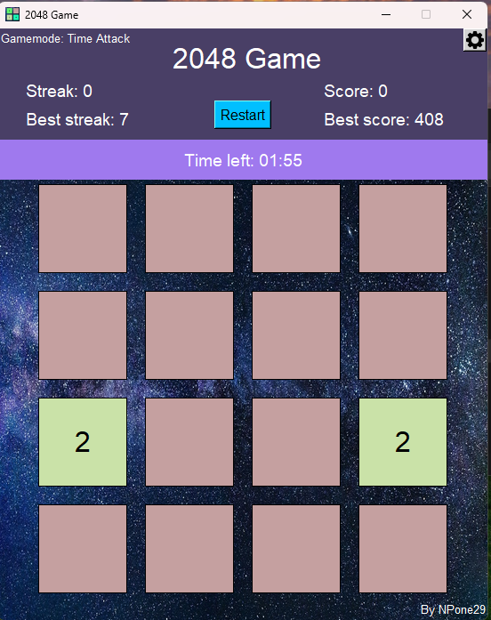
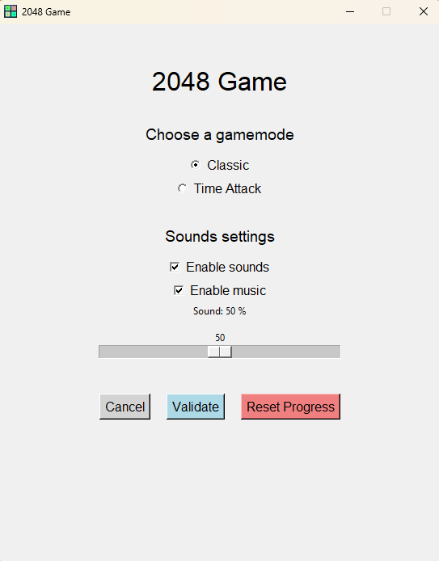

# MA-20_2048
Welcome to my 2048 game project! This project was developed from scratch as part of an exam assignment.
# Author
- [@NPone29](https://github.com/NPone29)

## About
A space-themed version of the classic 2048 puzzle game, built with Python.

### Classic game mode:


### Time Attack game mode:


### Settings:


# Install and play to 2048 game:
- Simple installation (for playing only): This is the fastest method: just install the .exe file and you can start playing immediately.
- Full installation (for modifying the game): This version is intended for users who want access to the source code and wish to customize the game. The installation is a bit more technical, but it gives you access to all the project files.

# Simple Installation
You can install the .exe file in two different ways:

- Installation via the terminal (CMD)
- Installation by directly downloading the .exe file

## Installation via CMD
1. Open the CMD.
2. Run the following command to download the executable:
```bash
curl -L -o Space.2048.V1.0.exe https://github.com/NPone29/MA-20_2048_Humblet_Natan/releases/download/V1.0/Space.2048.V1.0.exe 
```

## Installation by downloading the file
1. Click on our release link: https://github.com/NPone29/MA-20_2048/releases/tag/V1.0
2. Download the .exe file.

### Launching the game
Once the .exe is installed, everything should work correctly.
To start the game, simply run the .exe file.

## Full Installation

#### Prerequisites

Before installing the game, make sure you have Git and Python installed on your computer:

- Git: https://git-scm.com/install/
- Python: https://www.python.org/downloads/

1. Open Git CMD (or any compatible terminal).
2. If you want to install the game into a specific folder, change to that folder with: cd "your target path"
3. Clone the repository with the following command:

```bash
git clone "https://github.com/NPone29/MA-20_2048"
```

After cloning the repository you are almost ready to play!

### Install dependencies:

The Github contain a requirements.txt. So you can just run this command : 
```bash
pip install -r requirements.txt
```

If you have trouble installing pygame or the terminal shows an error, here are a couple of suggestions:
- Download [PyCharm](https://www.jetbrains.com/pycharm/download/?section=windows) Community edition (free)
- Or install an older Python version (for example: 3.11)

### Launching the game:

Once all packages are installed, the game should run correctly.

To start the game, go into the repository folder and run main.py:

```bash
cd [Your Folder Path]
python main.py
```

## Support

For support, you can contact NPone29#0000 via Discord.

## CPNV school

